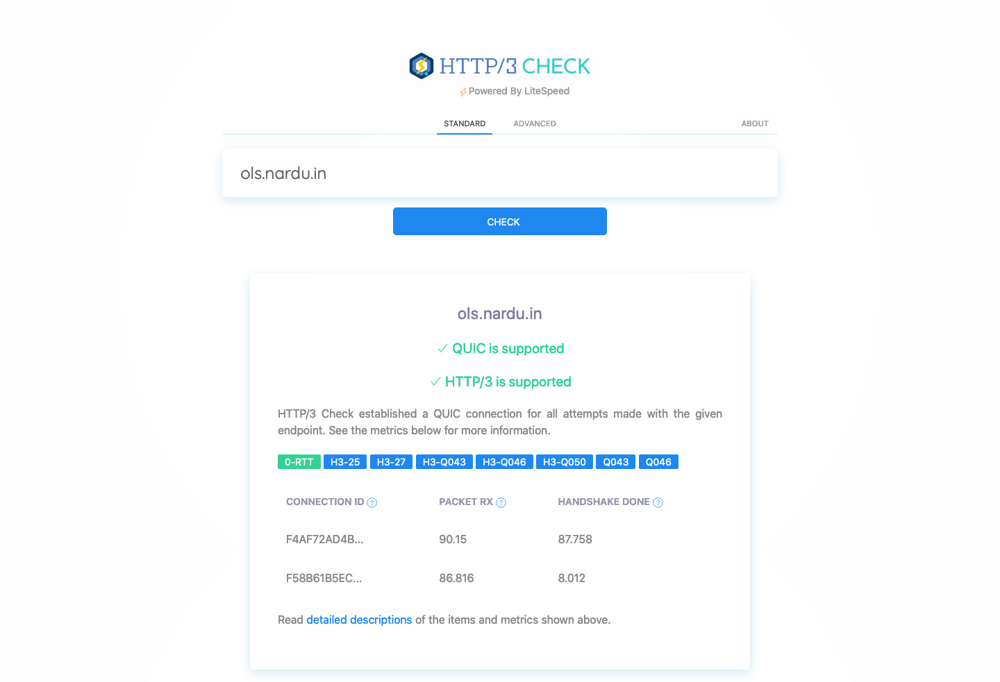
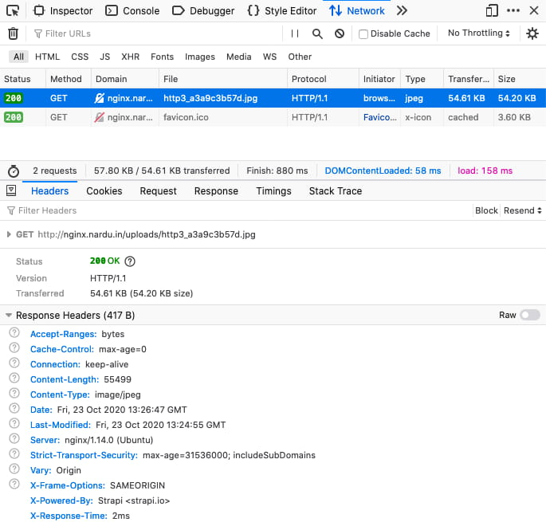
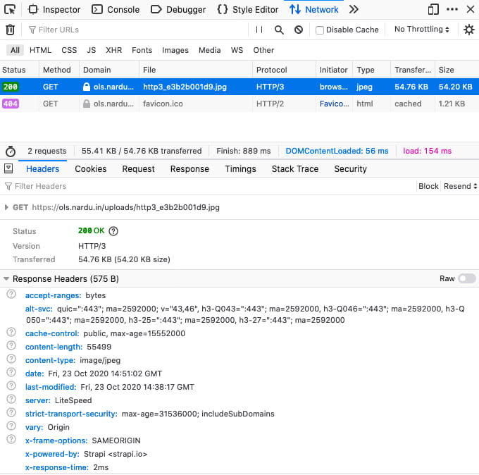

# Strapi on OpenLiteSpeed

Why do it simple when you can do it weird?

## Why would you do that?

When it comes to web servers, it's usually a question of nginx or ~~nginx~~ apache. Recently, it might not even be a question anymore considering tools like [netlify](https://www.netlify.com/ "Netlify’s website") or [vercel](https://vercel.com/ "Vercel’ website") handle almost all backend configuration on their own.

However, when installing Strapi the regular way, we need to choose. I chose [OpenLiteSpeed.](https://openlitespeed.org "OpenLiteSpeed’s website")

### Benefits of OpenLiteSpeed

- it has a graphical interface
- overall performances are better than nginx or apache ([test1](https://www.cyberhosting.org/openlitespeed-vs-nginx/ "Third party test of OLS vs nginx") - [test2](https://www.litespeedtech.com/benchmarks/litespeed-small-static-file-faster-nginx-http2 "Official test of OLS vs nginx vs apache"))
- its [caching performances](https://openlitespeed.org/benchmarks/small-static-file/ "Performance comparison between OpenLiteSpeed, nginx and apache") are great
- it has a good [documentation](https://openlitespeed.org/support/ "OpenLiteSpeed’s documentation")
- http/3 (quic) support out of the box
- and more [features](https://openlitespeed.org/#features "list of OLS features")

## The interesting part

### Deploying OpenLiteSpeed

OpenLiteSpeed can be installed on a server (ubuntu/debian/centOS) through a neat [1click script](https://openlitespeed.org/kb/1-click-install/ "1 click install OpenLiteSpeed") or using [a pre-configured image](https://do.co/2LUwBVp "OpenLiteSpeed image on Digital Ocean") like Digital Ocean offers.

I tried both and everything works just fine it's a real pleasure. Here is the 1click install line that I used: `bash ols1clk.sh`  
This line will install OLS without Wordpress.

[](https://www.http3check.net "Check http3 status")

### Deploying Strapi

I followed the [Digital Ocean guide](https://strapi.io/documentation/v3.x/getting-started/deployment.html "Strapi deployment guides") and set up Strapi, the database and pm2. I ignored the part about Nginx and allowing port 1337 although it can be useful for testing.

### Virtual host configuration

Here is the not so tricky part:

- login into your admin panel, usually accessible on port 7080 (your.ip.address:7080)
- add a new virtual host following [the official guide](https://openlitespeed.org/kb/setting-up-name-based-virtual-hosting-on-openlitespeed/ "New virtual host guide (new window)")
- the _Document Root_ does not matter, I set it to a folder containing an empty html file
- set the _Domain name_ to your strapi domain
- in the _External App_ tab, add a new 'Web Server'


Give it an obvious name, use the default Strapi address and port for the 'address' field: `0.0.0.0:1337`

- In the _Context_ tab, add a new 'Proxy' context


Use the root `/` for the 'URI' field and select your previously created web server form the list below.
I added some cache headers in the 'Header Operations' field (feel free to change this):

```
unset Cache-control
set Cache-control public, max-age=15552000
```

I allowed access to everyone with `*` and told the server to use `utf-8` as the default charset encoding (it never hurts).

### Listener configuration

On the listeners window [bind your virtual host to both http and https (ssl) listeners.](https://openlitespeed.org/kb/setting-up-name-based-virtual-hosting-on-openlitespeed/#Create_and_Assign_Listeners "Binding virtual host to listener guide (new window)")

It’s a pretty straight forward process. Or so I thought.

In order to serve both ipv4 and ipv6 [LiteSpeed recommends to use separate listeners.](https://www.litespeedtech.com/docs/webserver/config/listener-general "Listener LiteSpeed documentation (new window)") However, I ran into some problems trying to configure separate IPv4/IPv6 listeners so here's how to do it with one.

On the 'Address Settings', choose `[ANY] IPv6` for the 'IP Address' field. The 'Port' field depends on http/https (80/443) but **be sure to do both listeners.**

On the 'Virtual Host Mappings', add a new host and choose your Strapi virtual host from the drop-down. In order to listen to ipv4 and ipv6, we need to specify both IP adresses and use a particular syntax for the ipv4 by prepending it with `::FFFF:` as such: `::FFFF:IPV4, IPV6, domain.tld`


**We’re done!** Strapi should be accessible through its domain.
Don’t forget to perform a 'graceful restart' of OpenLiteSpeed and close port 7080 when you’re done with the admin panel.

## When to use OpenLiteSpeed

I would recommend OLS to people that are not familiar or not happy with handwritten server configuration. OLS provides so much settings that it's almost fun to configure and very fast to try out. Plus it's always nice to have a graphical interface 😬

## Real life comparison

Without doing any web server configuration except the bare minimum

### Strapi on nginx (digital ocean app)

I used the 1click app on Digital Ocean's market place that uses nginx.
Installed dependencies with `yarn install`, built for production `NODE_ENV=production yarn build` and ran `NODE_ENV=production yarn start`

Adding an image and checking its status shows us that it is being served using http/1.1 by default.



### Strapi on OLS (manual install)

There is **a bit more work** to be done of course but it's mainly wget, curl and apt command to install some stuff (OLS, nvm, yarn, ufw, git, etc.) and graphical configuration within OLS ❤️

After following this very tutorial, I successfully configured and deployed Strapi on OpenLiteSpeed.

Adding an image and checking its status shows us that it is being served using http/3 by default (if your browser supports it otherwise it's http/2).


